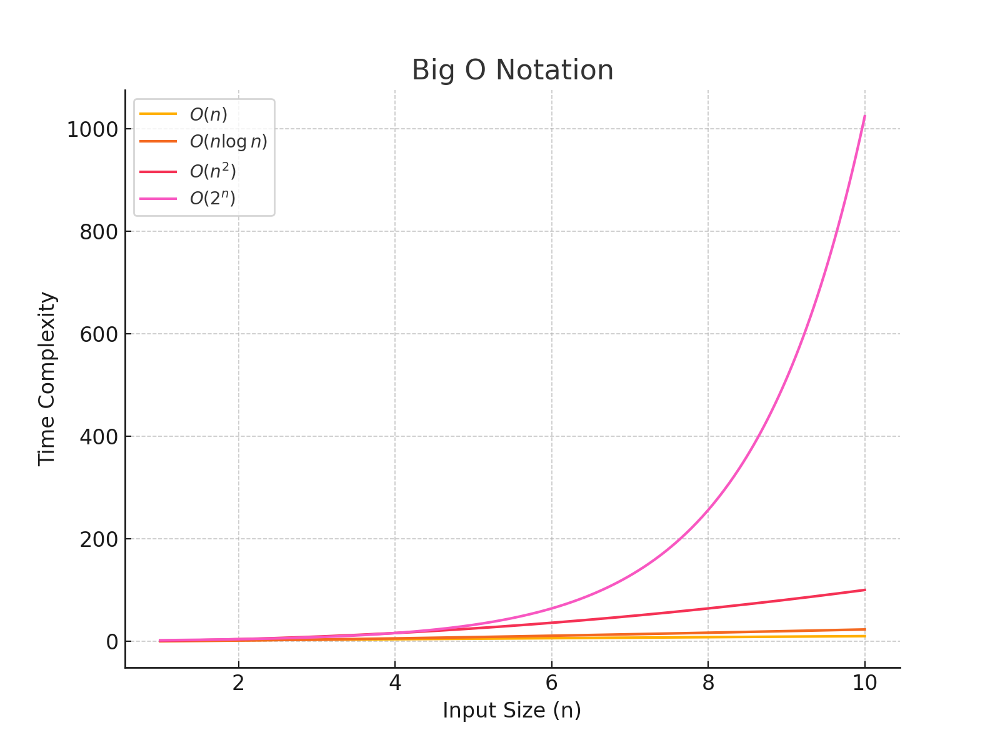
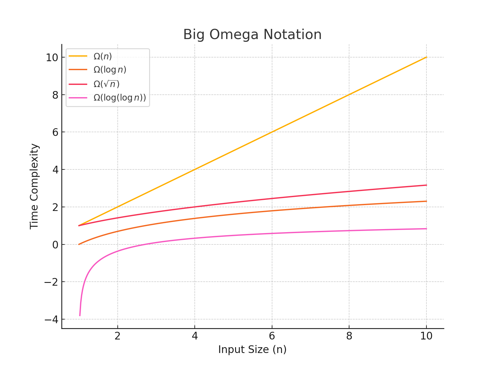
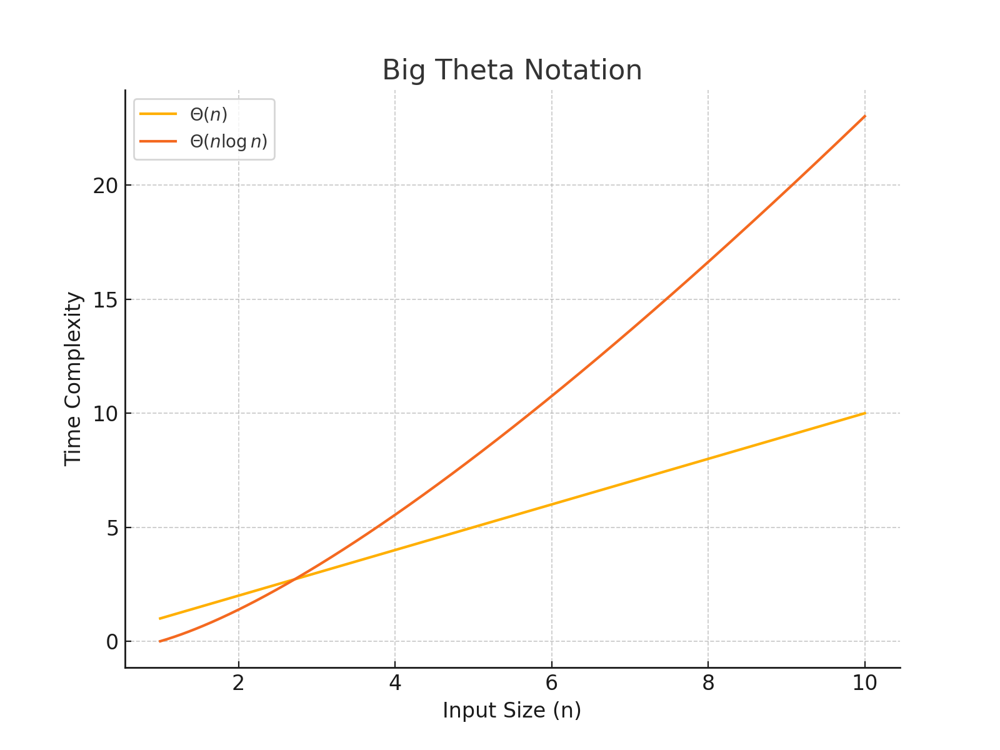
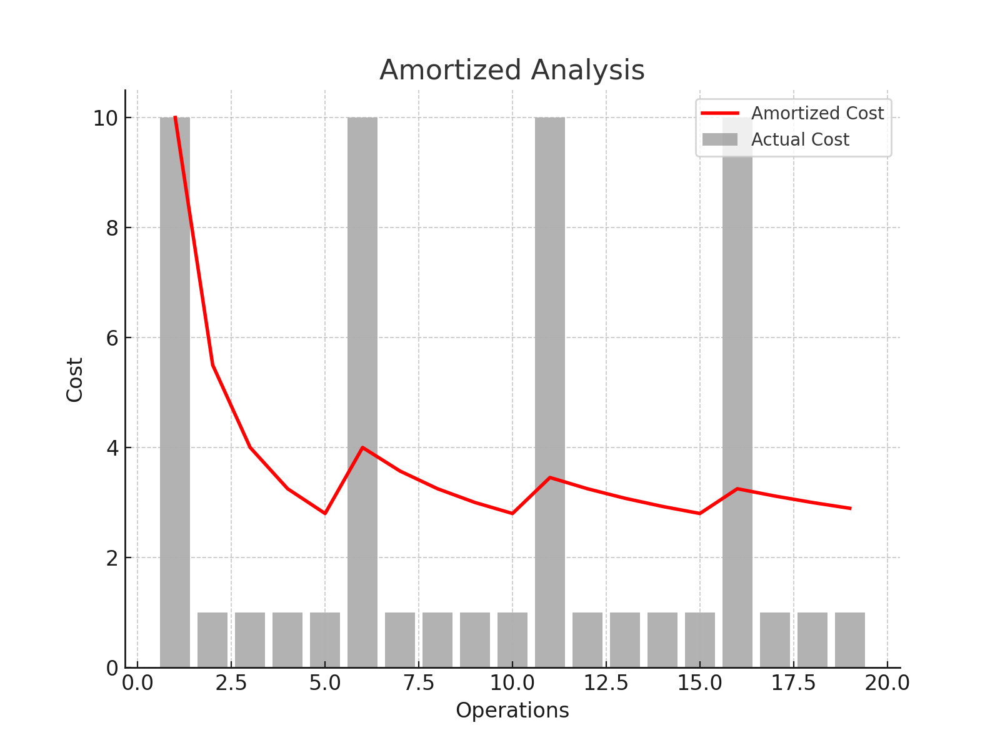

# Notations
## Why Do We Use Notations?
In computer science and algorithm analysis, notations are essential for describing the efficiency and complexity of algorithms. They provide a standard way to discuss the performance of algorithms in terms of time and space requirements. Notations help in comparing different algorithms and in predicting how an algorithm will scale with input size. By using notations, we can abstract away from machine-specific details and focus on the fundamental characteristics of an algorithm.

## Big O, Big Ω, Big Θ Notations
These notations are used to describe the upper, lower, and tight bounds of an algorithm's running time or space requirements as a function of input size n.

### Big O Notation (O)
* Definition: Big O notation describes the upper bound of an algorithm's running time. It gives the worst-case scenario of how the runtime or space requirements grow relative to the input size.
* Usage: It is used to ensure that the algorithm will not exceed a certain time or space complexity.
* Example: If an algorithm runs in O(n^2) time, it means that in the worst case, the runtime will grow no faster than a constant times n^2.
* Visualization: Shows various time complexities such as 
O(n), O(nlogn), O(n^2), and O(2^n). 

### Big Ω Notation (Ω)
* Definition: Big Ω notation describes the lower bound of an algorithm's running time. It provides a guarantee that the algorithm will run at least this fast.
* Usage: It is used to describe the best-case scenario or to ensure a minimum performance level.
* Example: If an algorithm runs in Ω(n) time, it means that in the best case, the runtime will grow at least as fast as a constant times n.
* Visualization: Displays the lower bounds for time complexities including Ω(n), Ω(logn), Ω(sqrt(n)), and 
Ω(log(logn)). 

### Big Θ Notation (Θ)
* Definition: Big Θ notation describes the tight bound of an algorithm's running time. It provides both the upper and lower bounds, meaning the algorithm runs within these bounds in both the best and worst cases.
* Usage: It is used when an algorithm's runtime is tightly bound and predictable.
* Example: If an algorithm runs in Θ(nlogn) time, it means that the runtime grows exactly as a constant times nlogn.
* Visualization: Illustrates the tight bounds for 
Θ(n) and Θ(nlogn). 

## Amortized Analysis
Amortized analysis is used to average the running time of operations over a worst-case sequence of operations. It provides a more nuanced understanding of an algorithm's performance by considering the entire sequence of operations rather than individual operations.

### Usage
It is particularly useful for algorithms where occasional operations might be expensive, but most are cheap. By averaging out the expensive operations over a sequence, we get a better understanding of the algorithm's efficiency.

### Example 
In a dynamic array, resizing the array can be an expensive operation. However, since resizing happens infrequently, the amortized cost per insertion is O(1).

### Visualization
Depicts the actual cost vs. the amortized cost for a sequence of operations, where every 5th operation is more expensive. 
